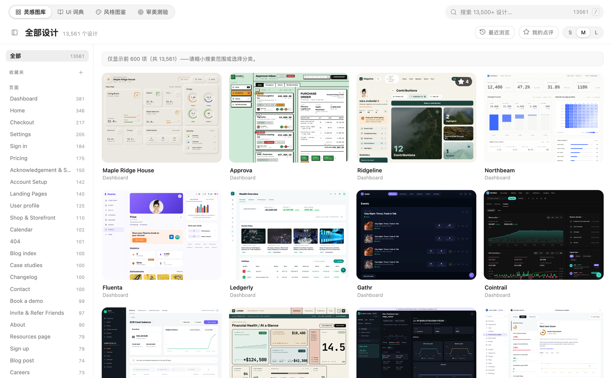
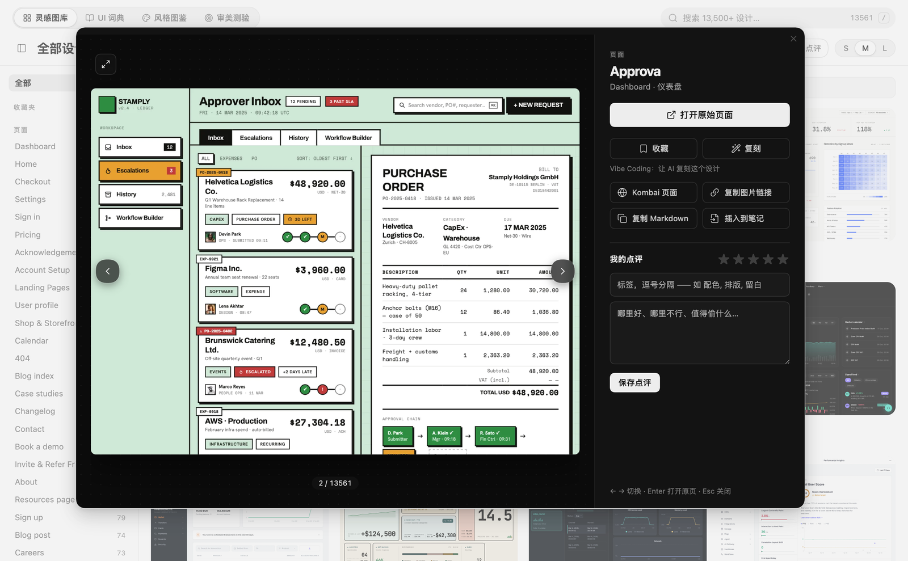
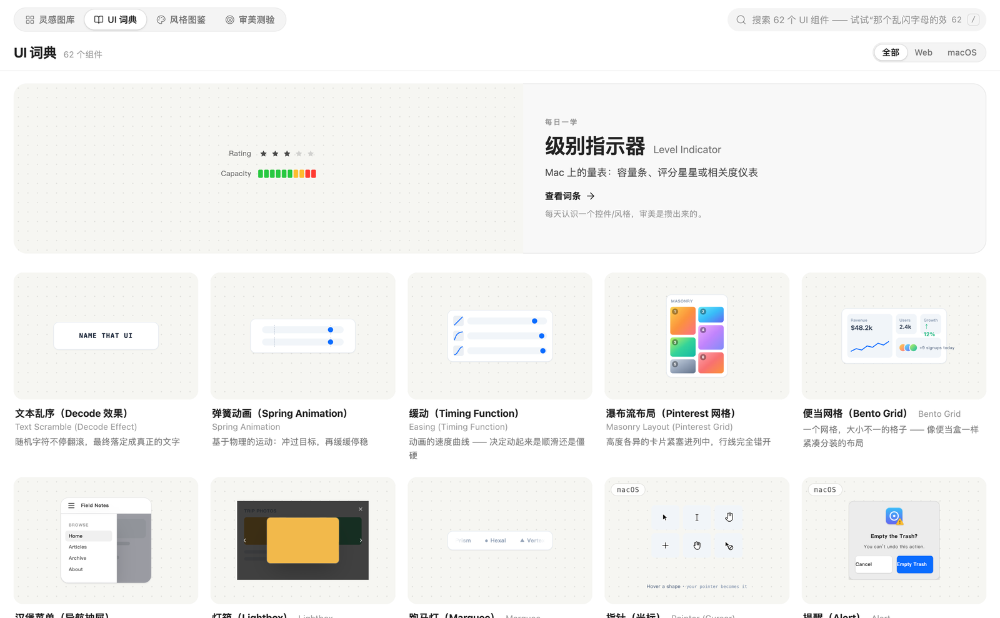
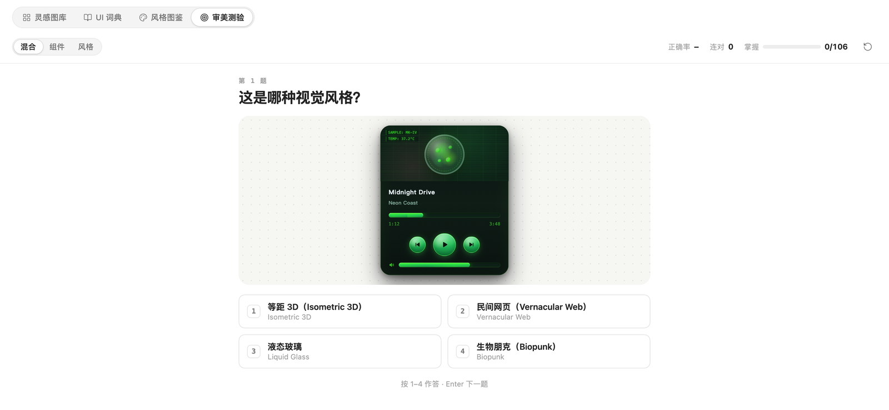

# 乔木 UI 学习 · Qiaomu UI Learn

**中文** | [English](#english)



> **在 Obsidian 里学 UI 设计：** 13,500+ 真实设计图库、中英双语 UI 词典、44 种风格图鉴、审美测验，学完直接做笔记，还能一键生成「复刻 Prompt」交给 AI 编程助手。
>
> **Learn UI design inside Obsidian:** 13,500+ real designs, a bilingual UI dictionary, a 44-style atlas and an aesthetic quiz — take notes as you go, and copy a replication prompt for your coding agent.

  

**已验证：** 在 Obsidian 桌面端实机运行；`npm run build` 与 `npm run check-i18n` 通过；`main.js` 内置全部数据，只拷贝 `main.js` / `manifest.json` / `styles.css` 三个文件即可使用（社区安装同样如此）。

## 这是什么

做界面，难的往往不是“不会做”，而是“说不出它叫什么、也不知道好的长什么样”。这个插件把学习 UI 的四件事放在同一个标签页里：

| 标签 | 你得到什么 |
|---|---|
| **灵感图库** | 13,561 个真实网页 / 区块 / 动效 / 设计系统，按 184 个分类浏览；悬停分类看中文名；搜索支持中英文分类名和你自己写的标签 |
| **UI 词典** | 62 个界面组件，每个都有可交互的实时标本、正式名称、人话解释、API 速查、AI Prompt 和 Debug Prompt；支持“那个乱闪字母的效果”这种口语搜索 |
| **风格图鉴** | 44 种视觉风格（新拟态、玻璃拟态、野兽派……），每种有标本、识别信号、易混淆对比和可粘贴的风格 Prompt |
| **审美测验** | 看标本猜名字，间隔重复，连对 2 次算掌握，进度自动保存 |


## 为什么值得用

- **看得懂也记得住**：不是收藏夹，而是“看图 → 学名词 → 做笔记 → 测验巩固”的闭环。
- **学了就能用（Vibe Coding）**：在任意设计上点「复刻」，生成包含截图、在线预览和做法步骤的 Prompt；页面和区块还能连同 HTML 源码一起复制。技术栈可在设置里改。
- **笔记在你自己的库里**：评分、标签、点评都能导出为 Markdown；收藏夹、最近浏览一键回看。
- **跟随 Obsidian 主题**：深浅色自动适配，窄屏有响应式布局，不加额外强调色。



## 核心能力

| 能力 | 说明 |
|---|---|
| 收藏夹 | 自建合集，卡片上悬停书签即可收藏，右键重命名 / 删除 |
| 复刻 Prompt | 复制 Prompt / Prompt + HTML 源码 / 存成笔记 |
| 点评与笔记 | 5 星评分 + 标签 + 文字，自动保存，一键导出学习笔记 |
| 悬停中文名 | 184 个分类全部带中文翻译，被截断的长名称悬停显示全称 |
| 最近浏览 / 我的点评 | 一键筛选 |
| 键盘友好 | `/` 搜索，灯箱 ← → 切换、Enter 打开原页，测验 1–4 作答 |

## 安装

**社区插件（审核通过后）：** 设置 → 第三方插件 → 浏览 → 搜索「乔木 UI 学习 / Qiaomu UI Learn」。

**手动安装 / BRAT：**

```bash
# 1. 从 Releases 下载 main.js、manifest.json、styles.css
# 2. 放进 <你的库>/.obsidian/plugins/qiaomu-ui-learn/
# 3. 设置 → 第三方插件 → 启用「乔木 UI 学习」
```

BRAT 用户直接添加仓库 `joeseesun/qiaomu-ui-learn` 即可。

## 使用

- 左侧栏图标或命令面板：**打开乔木 UI 学习**、**打开 UI 词典**、**打开风格图鉴**、**开始审美测验**。
- 设计卡片 → 灯箱：打开原页 / 收藏 / 复刻 / 复制图片链接或 Markdown / 插入到当前笔记 / 写点评。
- 设置里可选默认打开的标签、笔记文件夹（支持浏览选择）、复刻技术栈，并查看学习统计。




## 联网与隐私

插件**没有任何统计或上报**。只在你使用到下面这些功能时才会访问网络：

| 用途 | 域名 |
|---|---|
| 图库缩略图（浏览时按需加载） | `kombai-assets.b-cdn.net` |
| 打开原页 / 设计详情页 / 复制 HTML 源码 | `kombai.com`、`agent.kombai.com` |
| 设置页里的打赏与公众号二维码 | `radio.qiaomu.ai` |

评分、点评、收藏夹、测验进度都保存在你库里的 `.obsidian/plugins/qiaomu-ui-learn/data.json`。

## 数据来源与版权

- **灵感图库**的设计目录和缩略图来自 [Kombai Gallery](https://kombai.com/gallery/)，版权归各设计作者与 Kombai 所有；插件只内置名称与索引，图片按需从其 CDN 加载，并非官方产品，与 Kombai 无隶属关系。
- **UI 词典 / 风格图鉴**的英文内容源自 [namethatui.com](https://namethatui.com/)（经 [joeseesun/learnui](https://github.com/joeseesun/learnui) 整理为中英对照），英文原文版权归原作者；中文译文、构建脚本与本插件代码以 MIT 开源。
- “复刻 Prompt”仅供学习参考，请不要照搬原设计的品牌、文案与图片。

如果你是上述内容的权利人并希望调整或移除，请通过 Issue 联系。

## 开发

```bash
npm install
npm run dev          # 监听构建
npm run build        # 类型检查 + 生产构建（输出 main.js）
npm run check-i18n   # 中英文词条必须同步
npm run build:learnui  # 由 vendor/learnui 重新生成词典数据
```

结构：`src/`（插件源码）· `data/`（目录与词典数据，构建时打进 `main.js`）· `vendor/learnui/`（词典源数据与标本）· `docs/assets/`（截图）。欢迎提 Issue / PR，见 [CONTRIBUTING.md](CONTRIBUTING.md)。

## 关于向阳乔木

- 网站 [qiaomu.ai](https://qiaomu.ai/) · 博客 [blog.qiaomu.ai](https://blog.qiaomu.ai/)
- X [@vista8](https://x.com/vista8) · GitHub [@joeseesun](https://github.com/joeseesun)
- 公众号：**向阳乔木推荐看**（二维码见插件设置页）

License: [MIT](LICENSE)

---

<a name="english"></a>

# English

**Qiaomu UI Learn** turns Obsidian into a place to learn UI design. One tab gives you four things:

| Tab | What you get |
|---|---|
| **Gallery** | 13,561 real pages / sections / animations / design systems across 184 categories; hover a category for its Chinese name; search by category (English or Chinese) and by your own tags |
| **UI Dictionary** | 62 UI components with live, interactive specimens, the official name, a plain-language explanation, an API cheat sheet, and AI / debug prompts. Vernacular search works ("the shuffling-letters thing") |
| **Style Atlas** | 44 visual styles with specimens, recognition signals, "often confused with" comparisons and a pasteable style brief |
| **Aesthetic Quiz** | Guess the name from the live specimen; spaced repetition; mastery is saved |

**Vibe coding:** open any design and press **Replicate** to copy a ready-made prompt (screenshot, live preview, step-by-step approach). For pages and sections you can also copy the prompt together with the page's HTML source, or save it as a note. The tech stack is configurable.

Also included: collections (bookmarks), recent items, ratings + tags + notes with Markdown export, keyboard shortcuts (`/` to search, ← → in the lightbox, 1–4 in the quiz), and light / dark theme support with a responsive layout.

### Install

- **Community plugins** (once approved): Settings → Community plugins → Browse → "Qiaomu UI Learn".
- **Manual / BRAT:** download `main.js`, `manifest.json`, `styles.css` from the latest release into `<vault>/.obsidian/plugins/qiaomu-ui-learn/`, or add `joeseesun/qiaomu-ui-learn` in BRAT. All data is bundled inside `main.js`; no extra files are needed.

### Network use & privacy

No analytics or telemetry. The network is touched only when you use these features: gallery thumbnails from `kombai-assets.b-cdn.net`; opening a design / copying HTML source via `kombai.com` and `agent.kombai.com`; the support QR codes on the settings page from `radio.qiaomu.ai`. Ratings, notes, collections and quiz progress stay in the plugin's local `data.json`.

### Data sources & credits

The gallery catalogue and thumbnails come from [Kombai Gallery](https://kombai.com/gallery/); the dictionary and style atlas are adapted from [namethatui.com](https://namethatui.com/) via [joeseesun/learnui](https://github.com/joeseesun/learnui) with Chinese translations. Original content remains © its authors; this project is not affiliated with either site. Plugin code and translations are MIT. Replication prompts are for learning — do not copy original branding or copy. Rights holders who want changes or removal: please open an issue.

### Development

`npm install` · `npm run dev` · `npm run build` · `npm run check-i18n`. See [CONTRIBUTING.md](CONTRIBUTING.md).

By [向阳乔木 (Qiaomu)](https://qiaomu.ai/) · [X @vista8](https://x.com/vista8) · [GitHub @joeseesun](https://github.com/joeseesun) · License: [MIT](LICENSE)
